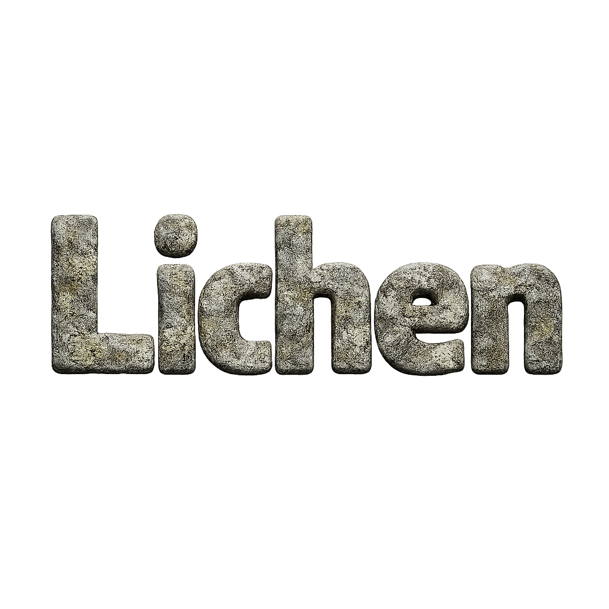

# LichenVM

*infrastructure for type checkers, static analyzers and language intelligence tools*

  

<<<<<<< HEAD
[English](README.md) | [简体中文](README.zh-CN.md)

=======
>>>>>>> upstream/main

## Why LichenVM
While countless DSLs are invented for ML kernels these years, static analysis on them is almost unimplemented, or not integrated into language services.

Some embedded-DSLs try relying on host-language's type system to encode their static analysis, which usually brings much slower analysis speed, and completely different runtime integration.

All this leads to an idea: we have LLVM for compilers, now we need "LLVM" for static analyzers: "LichenVM", that is modular, layered and composable, gradually adding more checking properties to original runtime program.

## Features
- **Unified Runtime**
  
  Value computing, type checking and more, all encoded into a unified runtime compute graph: type can be computed, value can depend on type.  

- **Modular Analysis Property**
  
  Value is a property of expression, so do types, they are defined by plugins, can be extended by down-stream plugins, and more property like visibility, can be defined.

- **Zero Cost Plugin System**
  
  The plugin system uses enum dispatch for extendable concepts like value and operator, which is implemented via code generation.

- **Inference Anything**
  
  Unified runtime can add equality constraints for nodes, the value of these nodes will be inferred structurally/recursively: value can be inferred from value or type, type can be inferred from type or value.

## Start Developing
<<<<<<< HEAD
Still in prototyping, check the tests.
=======
Still in prototyping, check the tests.
>>>>>>> upstream/main
